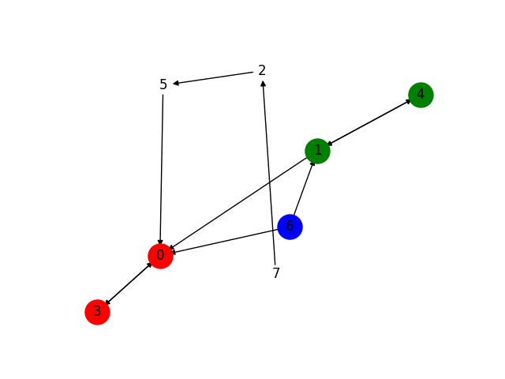
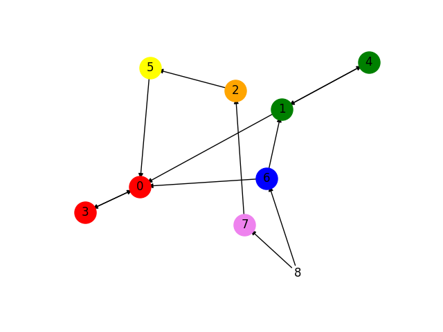
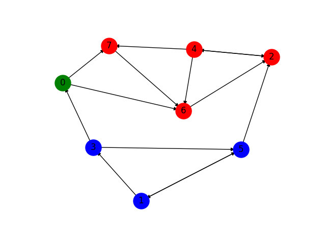

# Применение алгоритма Тарьяна для систем уравнений
В данном репозитории изложены идеи о применении алгоритма Тарьяна для работы с системами (необязательно линейных) уравнений. 
### Навигация по ключевым моментам
1. [Пример для проблемы 1: поиск минимального набора](#Пример-1.-Применение-алгоритма)
2. [Проблема 2: разбиение системы на уравнение и подстановки](#Задача-2.-Обнаружение-последовательности-формальных-подстановок-при-решении-систем-уравнений)
3. [Вывод программы для проблемы 2](#Результат-работы)
   
## Представление системы уравнений в виде графа
#### Постановка задачи
$$
S:\left\{\begin{array}{cccc}
f_1\left(z_1, z_2, \ldots, z_n\right) & = & 0 & e_1 \\
f_2\left(z_1, z_2, \ldots, z_n\right) & = & 0 & e_2 \\
\vdots & & & \\
f_n\left(z_1, z_2, \ldots, z_n\right) & = & 0 & e_n
\end{array},\right.
$$

#### Формализация
Введём двудольный граф $G = (V_1 \cup V_2, \ E)$. $V_1$ - множество вершин, которые отражают уравнения, $V_2$ - вершины для переменных, ребро $e \in E$ соединяет $v_1, v_2$, если переменная уравнение $v_1$ зависит от $v_2$. Матрица смежности $M$: по строкам у неё уравнения, по стобцам - переменные. Если $M_{ij} = 1$, то $i$-ое уравнение зависит от $j$-переменной. 

## Задача 1. Нахождение минимального набора уравнений для вычисления неизвестной(-ых) переменных
<h3 align="center">Алгоритм</h3>

- Вычисляется такая перестановка рядов матрицы $M$, что на главной диагонали должны стоять единицы.

$$
  M^{'} = 
  \begin{pmatrix}
    1 & a_{12} & \dots & a_{1n}\\
    a_{21} & 1 & \dots & a_{2n} \\
    \vdots & \vdots & \dots & a_{n - 1, n} \\
    \dots & \dots & \dots & 1
  \end{pmatrix}
$$ 

- Задача в том, чтобы привести матрицу к блочной нижнетреугольной форме (БНТ-форма). Алгоритм Тарьяна, в зависимости от стартовой вершины, будет выдавать компоненты сильной связанности, которые зависят (связаны) от стартовой вершины.
**Поэтому, если искомая переменная выбрана как стартовая вершина, то БНТ-трансформация будет содержать уравнения и переменные, которые зависят от неё.**

Для того чтобы обойти это ограничение, нужно ввести новую вершину $R$ (назовём её **корневой**), которая будет соединена выходящими ребрами с переменными, которые необходимо исследовать. Тогда в качестве стартовой вершины нужно взять корневую $R$.

C точки зрения системы уравнений, добавляется вспомогательная переменная $r = f_r(z_1, \dots z_h)$, аргументы - исследуемые переменные.

### Пример 1. Применение алгоритма

$$
\left\{\begin{array}{l}
\dot{x_1}(t)=-x_1(t) \\
\dot{x_2}(t)=x_1(t)-x_2(t) \\
\dot{x_3}(t)=x_1(t) \\
y_1(t)=3 x_2(t)+x_1(t) \\
y_2(t)=2 x_3(t)
\end{array} \right.
$$

Три переменных состояния ($x_1, x_2, x_3$) и две алгебраические переменные $y_1, y_2$. Введём три вспомогательных уравнения, показывающие связь между переменной $x_i$ и её производной $\dot{x_i}$:

$$
\left\{\begin{array}{lll}
\dot{x_1}+x_1 & =0 & e_0 \\
\dot{x_2}-x_1+x_2 & =0 & e_1 \\
\dot{x_3}-x_1 & =0 & e_2 \\
y_1-3 x_2-x_1 & =0 & e_3 \\
y_2-2 x_3 & =0 & e_4 \\
x_1-f\left(\dot{x_1}\right) & =0 & e_5 \\
x_2-g\left(\dot{x_2}\right) & =0 & e_6 \\
x_3-h\left(\dot{x_3}\right) & =0 & e_7
\end{array}\right.
$$

Матрица смежности:

$$
\begin{aligned}
& \begin{array}{llllllllll}
\ & \ & x_1 & x_2 & x_3 & \dot{x}_1 & \dot{x_2} & \dot{x}_3 & y_1 & y_2
\end{array} \\
& \begin{array}{l}
e_0 \\
e_1 \\
e_2 \\
e_3 \\
e_4 \\
e_5 \\
e_6 \\
e_7
\end{array}\left(\begin{array}{llllllll}
1 & 0 & 0 & 1 & 0 & 0 & 0 & 0 \\
1 & 1 & 0 & 0 & 1 & 0 & 0 & 0 \\
1 & 0 & 0 & 0 & 0 & 1 & 0 & 0 \\
1 & 1 & 0 & 0 & 0 & 0 & 1 & 0 \\
0 & 0 & 1 & 0 & 0 & 0 & 0 & 1 \\
1 & 0 & 0 & 1 & 0 & 0 & 0 & 0 \\
0 & 1 & 0 & 0 & 1 & 0 & 0 & 0 \\
0 & 0 & 1 & 0 & 0 & 1 & 0 & 0
\end{array}\right) \\
&
\end{aligned}
$$

Переставляем строки так, чтобы на главной диагонали были 1. Алгоритм даст перестановку $\{0, 1, 7, 5, 6, 2, 3, 4\}$:

$$
\begin{aligned}
& \begin{array}{l}
e_0 \\
e_1 \\
e_7 \\
e_5 \\
e_6 \\
e_2 \\
e_3 \\
e_4
\end{array}
\left(\begin{array}{llllllll}
1 & 0 & 0 & 1 & 0 & 0 & 0 & 0 \\
1 & 1 & 0 & 0 & 1 & 0 & 0 & 0 \\
0 & 0 & 1 & 0 & 0 & 1 & 0 & 0 \\
1 & 0 & 0 & 1 & 0 & 0 & 0 & 0 \\
0 & 1 & 0 & 0 & 1 & 0 & 0 & 0 \\
1 & 0 & 0 & 0 & 0 & 1 & 0 & 0 \\
1 & 1 & 0 & 0 & 0 & 0 & 1 & 0 \\
0 & 0 & 1 & 0 & 0 & 0 & 0 & 1
\end{array}\right) \\
&
\end{aligned}
$$

Предположим, что нужно найти минимальный набор уравнений, которые нужны для вывода переменной $y_1$.



Вывод программы:
```
[[3, 0], [4, 1], [6]]
```

**Строки и столбцы нумеруются от 1 до $N$**, так формируются вершины. Они соединяются ребром, если на пересечении строки и столбца есть 1. Отсюда вывод о том, что количество переменных и уравнений должно совпадать для применения этого алгоритма.

Компоненты сильной связности, которые будут найдены алгоритмом Тарьяна - `[0, 3], [1, 4], [6]` - именно в порядке обнаружения компонент. Это уравнения $[e_0, e_5], [e_1, e_4], [e_3]$. Записав уравнения в определённом порядке получим матрицу сниженнной размерности в блочной нижнетреугольной форме: (переменные / столбцы в таком порядке: $x_1, \dot{x_1}, x_2, \dot{x_2}, y_1$).

$$
\begin{aligned}
& \begin{array}{l}
e_5 \\
e_0 \\
e_6 \\
e_1 \\
e_3
\end{array}
\end{aligned}\left(\begin{array}{lllll}
1 & 1 & 0 & 0 & 0 \\
1 & 1 & 0 & 0 & 0 \\
0 & 0 & 1 & 1 & 0 \\
0 & 1 & 1 & 1 & 0 \\
0 & 1 & 0 & 1 & 1
\end{array}\right)
$$

Найдём уравнения, необходимые для вычисления $y_1$ и $y_2$. Введём корневую вершину $R$ (на рисунке обозначена 8):



Вывод программы:
```
[[3, 0], [4, 1], [6], [5], [2], [7], [8]]
```

Как видим, для этого потребуются все уравнения в системе. Однако алгоритм Тарьяна привел матрицу в БНТ-форму, если переставить **уравнения и переменные** (строки и столбцы) в обнаруженном порядке. 

### Код

```python
detector = MinimalSubsetDetector.initfromTeX(
    8,
    r'1 & 0 & 0 & 1 & 0 & 0 & 0 & 0 \\'
    r'1 & 1 & 0 & 0 & 1 & 0 & 0 & 0 \\'
    r'0 & 0 & 1 & 0 & 0 & 1 & 0 & 0 \\'
    r'1 & 0 & 0 & 1 & 0 & 0 & 0 & 0 \\'
    r'0 & 1 & 0 & 0 & 1 & 0 & 0 & 0 \\'
    r'1 & 0 & 0 & 0 & 0 & 1 & 0 & 0 \\'
    r'1 & 1 & 0 & 0 & 0 & 0 & 1 & 0 \\'
    r'0 & 0 & 1 & 0 & 0 & 0 & 0 & 1'
)
# Для поиска минимального набора уравнений для переменных у1 и у2.
# detector.addRootNode([6, 7])
answers = detector.find(6)
print(answers)
detector.color_SCC(answers)
```

## Задача 2. Обнаружение последовательности формальных подстановок при решении систем уравнений
**Вычисляемая последовательность формальных подстановок** - каждый элемент последовательности (уравнение) содержит в правой части только уже вычисленные неизвестные.
Введём матрицу $S_{n \times n}$ для правой части. Если последовательность вычисляема, то матрица $S$ - нижнетреугольная с нулями на диагонали.

Формальные подстановки, конечно, можно рассматривать как уравнения, но это увеличивает размер решаемой системы и может вызвать трудности для метода Ньютона (медленная сходимость, плохие начальные условия).
Целью является обнаружение формальных подстановок среди уравнений и их упорядочивание согласно определению формальных подстановок.
### Пример 0. Необходимое условие вычислимой последовательности 

$$ \begin{cases}
x_1 = A_1 \\
x_2 = \cos{x_1} + A_2 \\
x_3 = x_1^2 + x_1 + x_2 \\
x_4 = A_3
\end{cases} $$

Соответствующая матрица $S$:

$$ S = \begin{pmatrix}
   0 & 0 & 0 & 0 \\
   1 & 0 & 0 & 0 \\
   1 & 1 & 0 & 0 \\
   0 & 0 & 0 & 0 \\
\end{pmatrix} $$

Информацию о подстановках можно выразить в виде уравнения $x = Sx + C$. Выполнив процесс Гаусса над матрицей $S$ и решив уравнение $Sy = 0$, мы установим являются ли подстановки вычислимой последовательностью.

<h3 align="center">Алгоритм</h3>
  
1. Свести каждое уравнение системы к виду $x_i = f(x_1, \dots, x_n, t)$. $x_i$ не должен входить в правую часть выражения. Иначе, отнести это выражение в группу 'уравнений'.
2. Найти компоненты сильной связности с помощью алгоритма Тарьяна.
3. Удалить алгебраические петли. Запустить заново алгоритм Тарьяна.
4. Компоненты размера $1 \times 1$ являются подстановками, остальные - уравнениями.
5. Упорядочить последовательность и получить формальную вычислимую последовательность. 
### Пример 1. Применение алгоритма
$$
\left\{\begin{array}{l}
x_{1}=-7x_{7}+x_{8}-2 \\
x_{2}=3x_{4} - 2x_{6}+1 \\
x_{3}=\frac{x_{5}}{2}+8 \\
x_{4}=\frac{x_{6}}{x_{1}}+12 \\
x_{5}=(x_{7}+x_{8}+x_{3})^2-23 \\
x_{6}=x_{3}+x_{2}-3 \\
x_{7}=2 x_{3}+2 \\
x_{8}=(x_{7}-2)^3+2
\end{array}\right.
$$
#### Визуализация графа



#### Об удалении петель
В примере 1 можно выделить две алгебраические петли:

$$ 1. \ x_3 \Longrightarrow x_5 \Longrightarrow x_7 \Longrightarrow x_8 \Longrightarrow x_3 $$

$$ 2. \ x_2 \Longrightarrow x_4 \Longrightarrow x_6 \Longrightarrow x_2 $$

Определение **циклового порядка** ($CO$, cycling order) := max {количество входящих ребер из вершин компоненты сильной связности (КСС); количество исходящих ребер в вершины текущей КСС}.

Необходимо выбрать вершину с максимальный цикловым порядком, отнести её в разряд 'уравнений' и **удалить** из графа. $CO(x_5) = 3$, равный максимальному, её и удалим. 
Если вершин с максимальным цикловым порядком несколько, то выберем ту, что первая встретилась в алгоритме Тарьяна. В данном случае, удалим вершину $x_2$ с порядком 2, которая встретилась первой. \\

#### Код
```python
M = np.array([
    [0, 0, 0, 0, 0, 0, 1, 1],
    [0, 0, 0, 1, 0, 1, 0, 0],
    [0, 0, 0, 0, 1, 0, 0, 0],
    [1, 0, 0, 0, 0, 1, 0, 0],
    [0, 0, 1, 0, 0, 0, 1, 1],
    [0, 1, 1, 0, 0, 0, 0, 0],
    [0, 0, 1, 0, 0, 0, 0, 0],
    [0, 0, 0, 0, 0, 0, 1, 0],
])

tsk = SubstitutionDetector(dim=8)
tsk.set_matrix(M)
print(tsk.scc)
tsk.break_loops()
tsk.get_answer()
```
Вывод программы:
```
[[6, 7, 4, 2], [0], [1, 5, 3]] # компоненты сильной связности (КСС)
Для цикла [2, 4, 7, 6] будет удалена вершина: 4. Причина: Максимальный цикловый порядок
Для цикла [1, 3, 5] будет удалена вершина: 1. Причина: Максимальный цикловый порядок, первым встретился в алгоритме Тарьяна
Индексы уравнений: [4, 1]
Индексы(!) подстановок: [2, 6, 7, 0, 5, 3]
Индексы(!) подстановок, которые действительно есть в системе: []
```
#### Результат работы
Уравнения:

$$
\left\{\begin{array}{l}
x_{2}=3x_{4} - 2x_{6}+1 \\
x_{5}=(x_{7}+x_{8}+x_{3})^2-23 \\
\end{array}\right.
$$

Подстановки:

$$
\left\{\begin{array}{l}
x_{3}=\frac{x_{5}}{2}+8 \\
x_{7}=2 x_{3}+2 \\
x_{8}=(x_{7}-2)^3+2 \\
x_{1}=-7x_{7}+x_{8}-2 \\
x_{6}=x_{3}+x_{2}-3 \\
x_{4}=\frac{x_{6}}{x_{1}}+12 \\
\end{array}\right.
$$
Система вида:

\left\{\begin{array}{l}
x_{3}=f(x_5) \\
x_{7}=f_1(x_5) \\
x_{8}=f_2(x_5) \\
x_{1}=f_3(x_5) \\
x_{6}=g(x_2, x_5) \\
x_{4}=g_1(x_2, x_5) \\
\end{array}\right.

**Обратите внимание на порядок подстановок: теперь условие вычислимости соблюдается.** 

## Список литературы
1. _About detection substitutions in nonlinear algebraic equations with help of Tarjan's algorithm_. Isakov A.A., Senichenkov Yu.B., Distributed Computing and Networking department, Saint Petersburg state Polytechnical University
2. _Minimal Equation Sets for Output Computation in Object-Oriented Models_. Vincenzo Manzoni Francesco Casella Dipartimento di Elettronica e Informazione, Politecnico di Milano.
